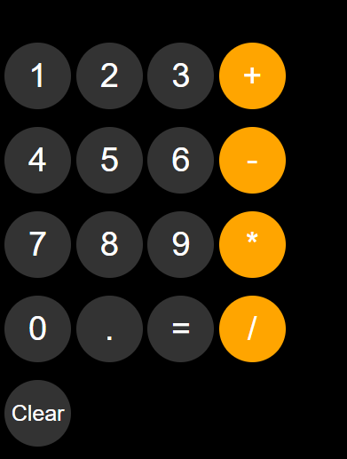

# Calculator App

A simple web-based calculator built using HTML, CSS, and JavaScript.

## Features
- Perform basic operations: Addition, Subtraction, Multiplication, Division.
- Clear and easy-to-use interface.

## Tech Stack
- HTML5
- CSS3
- JavaScript (DOM Manipulation)

## Screenshots

## Live Demo
🔗 [View Project on GitHub Pages](https://akramguroo-dev.github.io/calculator-html-css-js/)

## Author
- Akram Guroo (github.com/akramguroo-dev)
